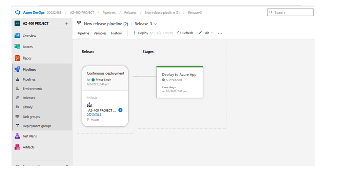

# Project 1 – Continuous Integration and Continuous Deployment (CI/CD) with Azure DevOps

## 📌 Overview
This project was implemented to streamline the software development and deployment process for Skill-up Technologies using Azure DevOps.  
A complete CI/CD pipeline was created for a sample web application to enable automatic builds and deployments upon any code changes.

---

## ✅ Project Implementation

### **1. Resource Group**
- Created **AZ400-Project1-RG** in the chosen Azure region to host the resources.

### **2. Azure DevOps Setup**
- Created a dedicated Azure DevOps project and initialized a Git repository to store application code.

### **3. CI Pipeline**
- Configured an automated build pipeline to:
  - Restore dependencies.
  - Build the application.
  - Generate build artifacts.

### **4. CD Pipeline**
- Configured the release pipeline to deploy the application to **Azure App Service**.
- Used deployment slots for safer releases.
- Implemented deployment tasks with environment-specific configurations.

### **5. Testing**
- Made updates to the code and pushed them to the repository.
- Verified the pipeline executed successfully, building and deploying the updated application automatically.

---

## 🧰 Tools & Services Used
- **Azure DevOps** – Repos, Pipelines (CI/CD)
- **Azure Services** – Resource Groups, App Service

---

## 📸 Screenshots 
1. Azure DevOps CI pipeline run.

      
2. Azure DevOps CD pipeline release.

   
   
3. Web App running in Azure after deployment.

4. Changes made in index.cshtml

5. Pipeline Triggered automatically and changes visible in webpage.

## 📜 Status
**✅ Completed** – CI/CD pipeline successfully built and deployed the web application.
